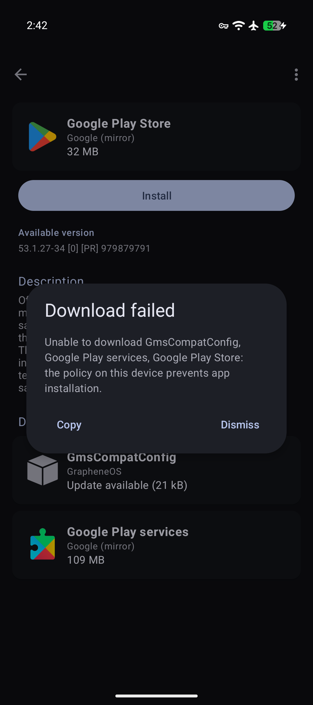
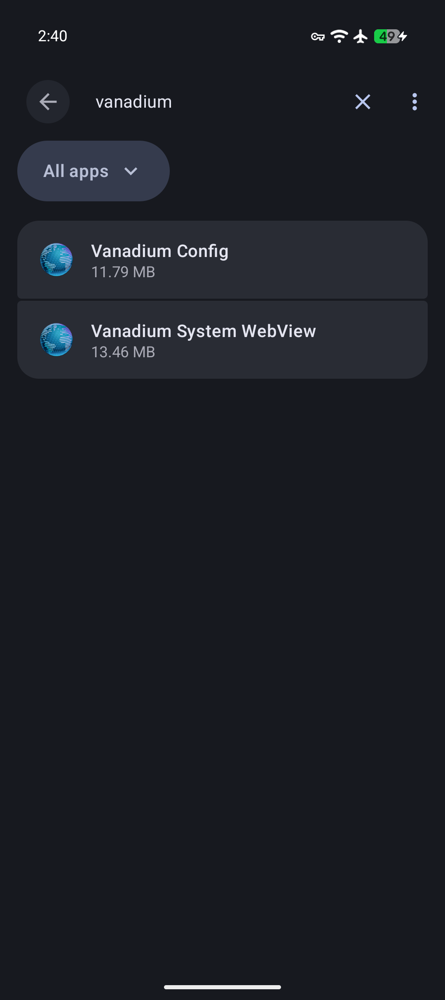
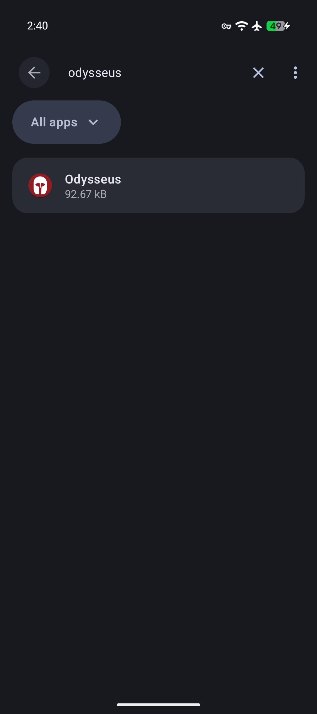
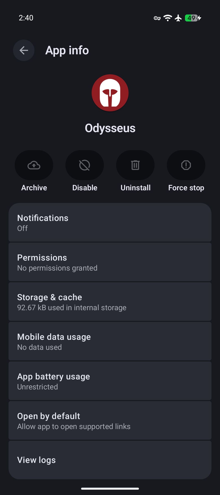

<div align="center"></div>

<h1 align="center">Odysseus</h1>

<br />

<p align="center">
  <a href="app/build.gradle.kts"></a>
  <a href="app/src/main/java/org/getflourish/odysseus"></a>
  
  <br />
  <a href="SECURITY.md#features"></a>
  <a href="app/src/main/AndroidManifest.xml"></a>
  <a href="SECURITY.md#verifying-a-release"></a>
  <br />
  <a href="LICENSE"></a>
  
  <a href="https://github.com/flourish-today/odysseus/releases/latest"></a>
</p>

<p align="center"><b>Make a GrapheneOS daily user with no browser and no app installs, just the apps you choose. Odysseus lets you turn your GrapheneOS phone into a dumbphone, but with all the benefits of a powerful smartphone (maps, messaging, password manager, etc), and none of the <a href="https://xxcancel.com/GrapheneOS/search?f=tweets&q=dumb%20phone&since=&until=&min_faves=">drawbacks</a> of a dumbphone.</b></p>

<h2 align="center">Download</h2>

<div align="center">
  <a href="https://apps.obtainium.imranr.dev/redirect?r=obtainium://add/https://github.com/flourish-today/Odysseus/releases"></a>
  <a href="https://github.com/flourish-today/Odysseus/releases"></a>
</div>

## How it works

<details>
<summary><b>Click here to see how it works</b></summary>
<br>

- **Owner is the manager.** You use Owner to set up the daily user and to add or update its apps. Owner remains unrestricted to manage the device.
- **The daily user is a restricted user for everyday use.** Odysseus creates it without the optional system apps, so on GrapheneOS it starts without the browser (Vanadium). It starts with a basic set: App Store, Contacts, Files, Settings, and Phone. You add the apps you want from Owner, then turn off app installs for the daily user. Once app installs are off, there's no way to add more from inside it.
- **No off switch in the daily user.** When the daily user starts for the first time, Odysseus blocks Private Space and debugging features in it, and hides its own icon. There is no Odysseus screen in the daily user to turn the restrictions off.

</details>

## Setup

### Before you start

-   You need a GrapheneOS phone.
-   Android only allows a device owner on a phone with no accounts, no other users, and no Private Space. You can either factory reset your phone, or back up your data and remove every account, every other user, and Owner's Private Space. If you only use Owner, removing all accounts in Settings and your Private Space is enough.
-   You need a USB-C cable and a computer with [ADB installed](https://developer.android.com/tools/adb).
-   **Make sure to back up all important data off your device.** You should do this even if you weren't using Odysseus in case your phone gets lost or breaks.
-   Owner's password is what keeps the daily user restricted. Pick one you can't easily get to yourself. For example, have someone you trust set it, or split it so you each know only half. You can also use a long password stored somewhere inconvenient or a long password you have memorized. Whatever method you pick, consider memorizing part of it and not sharing that part, so only you can get into the phone. 
- If the password is lost, the only way back is a factory reset.
-   Consider setting the [reboot timer](https://grapheneos.org/features#auto-reboot) to a longer length than you normally don't use your phone for because otherwise you will have to frequently unlock the Owner when it restarts, before moving to the user.

### Instructions

1.  Install Odysseus in Owner.
2.  Enable Developer options. Open Settings → About phone, tap Build number seven times, and enter your password. Developer options is now in Settings → System → Developer options.
3.  Turn on USB debugging in Developer options, connect the phone to your computer, and run the command Odysseus shows on its screen: `adb shell dpm set-device-owner org.getflourish.odysseus/.Receiver`
4.  Turn off Developer options in Settings.
5.  Open Odysseus. Under Create user, type a name like "user" and tap Create.
6.  In Owner, go to Settings → System → Users → (the daily user) → Install available apps, and choose the apps you want for the daily user. App installs stay enabled for a new user until step 8, so you don't need to enable them here. You can always add more later (see Adding apps). It's recommended to install all GrapheneOS default apps besides Vanadium to avoid breakage. Without Camera, for example, you can't take photos in Signal.
7.  Switch to the daily user and finish its setup. To avoid breaking apps that use WebView, go to the App Store and install Vanadium Config and Vanadium System WebView (see Usability limitations). They may already be installed.
8.  Go back to Owner, open Settings → System → Users → (the daily user), and set App installs and updates to Disabled.

### Troubleshooting

-   **The `set-device-owner` command fails with an error about accounts or users.** An account, another user, or Private Space still exists. Remove it and run the command again. A reliable way to set up Odysseus is after a factory reset.

## Adding apps

To add an app to the daily user:

1.  Install the app in Owner.
2.  In Owner, go to Settings → System → Users → (the daily user) and set App installs and updates to Enabled.
3.  Tap Install available apps and choose the app.
4.  Set App installs and updates back to Disabled before you switch to the daily user.

To update an app, simply update it in Owner. Both users share the same installed copy of an app, so the daily user gets the update too. You don't need to enable App installs and updates to get updates to your apps. That setting only stops the daily user itself from starting an install or update.

## To undo it

1.  In Owner, delete the daily user: Settings → System → Users → (the daily user) → Delete user.
2.  Open Odysseus and tap Deactivate.
3.  You can now uninstall Odysseus. If you don't delete the daily user, the restrictions on it seem to continue to work.

## Usability limitations

-   Leaving system apps out of the daily user can break apps. Links that would normally open in a browser won't open, because there is none.
-   WebView:
    -   **With Vanadium Config and Vanadium System WebView installed** (setup step 7), apps that need WebView work, but any app with a built-in browser may still let you browse the web. Choose the daily user's apps with that in mind. If an app lets you browse sites beyond the ones it needs, consider asking its developer to follow [Android security best practices](https://developer.android.com/privacy-and-security/security-best-practices#webview).
    -   **Without them**, built-in browsers can't load pages, but apps that need WebView break.
-   Private Space is unavailable in all users.

## FAQ

-   **Does Odysseus use AI?** Yes. This app was developed with Claude Opus 5.5. Its code was reviewed by GPT-6 Astra. AI security reviews of Odysseus found no way for other apps to use its device-owner powers and no network access. They found minor reliability issues, most of which have been fixed or found inconsequential. More reviews are welcome.
-   **Is Odysseus secure?** Odysseus uses the intended way to restrict devices on Android. It's tiny, requests no additional permissions, and only does what it says. See more info in [SECURITY.md](SECURITY.md).
-   **Is Odysseus privacy respecting?** Yes. There's no telemetry, no permissions, and no network access.
-   **What are the risks?** One risk with Odysseus, and device-owner apps in general, is the amount of trust you have to put in them. Device-owner apps are given a huge amount of permissions by Android. Odysseus uses only the few listed in [SECURITY.md](SECURITY.md), and they can be undone.
-   **Will I always need ADB?** In the future, depending on GrapheneOS, Odysseus may be updated so you can install it and make it the device owner without ADB, through QR code provisioning during initial device setup ([issue](https://github.com/GrapheneOS/platform_packages_apps_SetupWizard2/issues/35) / [pull request](https://github.com/GrapheneOS/platform_packages_apps_SetupWizard2/pull/40)). You can add reactions to show support, but please only comment if you have something meaningful to add.
-   **What if I have an iPhone or iPad that I want to achieve the same result on?** You should use Apple Configurator ([guide1](https://redlib.catsarch.com/r/nosurf/comments/1731ozp/how_to_turn_your_your_iphone_into_dumb_phone/) / [guide2](https://stopa.io/post/297)) to manage your devices, remove the browser and prevent new app installs. A macOS device and a factory reset of your iPhone/iPad are required for the initial setup.
-   **There's been no activity recently, is it still safe?** This is a simple app which will not require many updates.

## Screenshots

<details> <summary><b>Click here to see screenshots</b></summary> <br>

### Owner

<div align="center">     </div>

### User

<div align="center">     </div> </details>

## Disclaimer

Odysseus assumes zero responsibility for any issues you run into while using it. Support will be provided on a best-effort basis.

## Support

**Monero**

```
82omZG3aUU7gqJhR6dZGSReYvKD7kHFuxj5MGKMAGiJdcSYLnMb9Nky9UBxeuadSSzCNYpwfUueQBdQPEaTXmLH4Tkmbv39

```

## Public domain

Odysseus is dedicated to the public domain under CC0 1.0. See [LICENSE](LICENSE).
