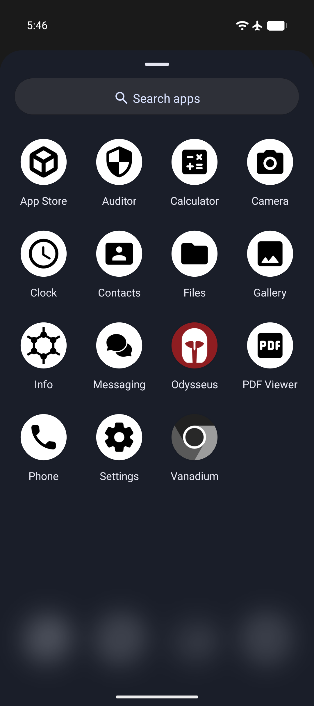
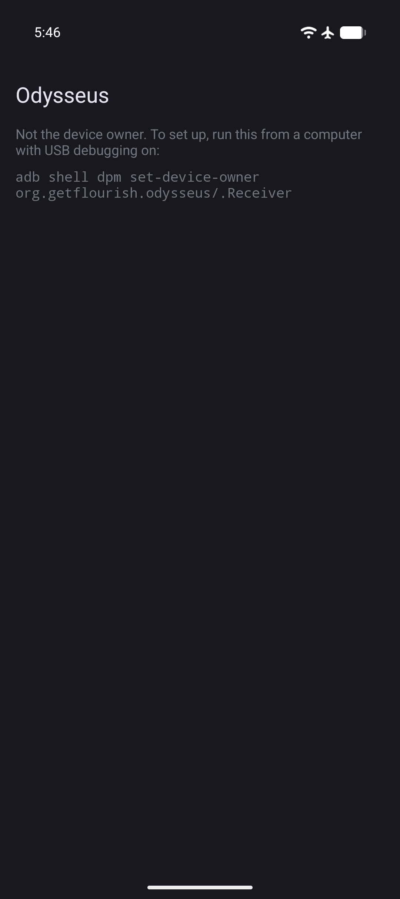
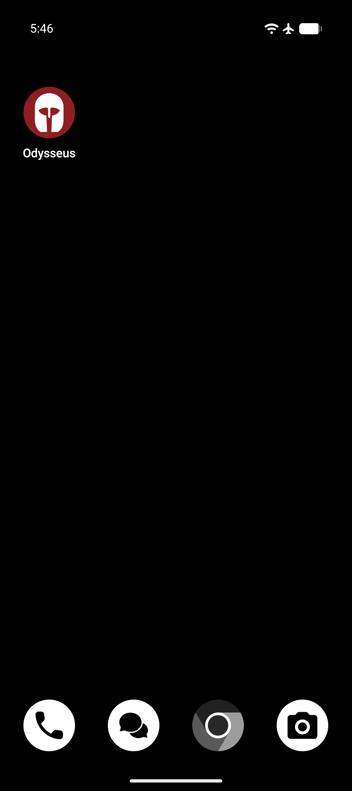
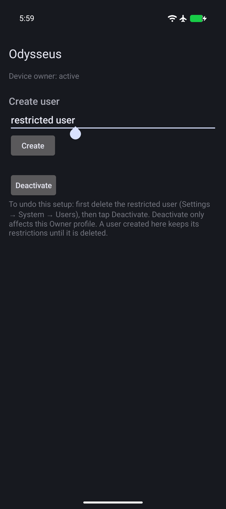
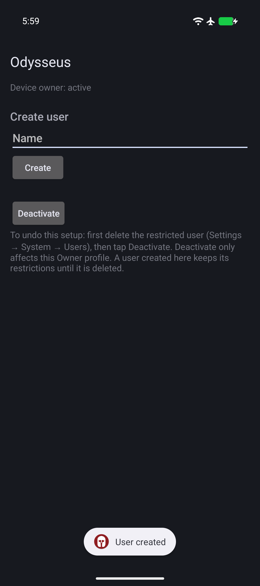

# Odysseus

Make a GrapheneOS daily user with no browser and no app installs, just the apps you choose.

## Screenshots

<div align="center">
    
    
    
    
    

</div>

## Download
[](https://apps.obtainium.imranr.dev/redirect?r=obtainium://add/https://github.com/flourish-today/Odysseus/releases)
[](https://github.com/flourish-today/Odysseus/releases)

## What it does

Odysseus helps you restrict your GrapheneOS phone. It lets you turn your GrapheneOS phone into a dumbphone, but with all the benefits of a powerful smartphone (maps, Signal, etc), and far fewer of the [drawbacks](https://xxcancel.com/GrapheneOS/search?f=tweets&q=dumb%20phone&since=&until=&min_faves=) of a dumbphone. It creates a separate daily user that has only the apps you choose. Once you finish setup and turn off app installs for it, there's no way to add more from inside it. The Owner profile remains unrestricted to manage the device.

## How it works

-   **The Owner profile is the manager.** You use the Owner profile to set up the daily user and to add or update its apps. Owner's screen lock password is what stops the daily user from changing anything, so if you know it, you can undo everything. For example, have someone you trust set it (you could give them just a portion of it that you don't have to prevent their access), or use a long password you store somewhere inconvenient. Consider keeping the [reboot timer](https://grapheneos.org/features#auto-reboot) at a higher time because otherwise you will encounter restarts and repeated Owner unlocks.
-   **The daily user is a restricted user for everyday use.** Odysseus creates it without the optional system apps, so on GrapheneOS it starts without the browser (Vanadium). It starts with a basic set: App Store, Contacts, Files, Settings, and Phone. You add the apps you want from Owner, then turn off app installs for the daily user.
-   **No off switch in the daily user.** When the daily user starts for the first time, Odysseus blocks Private Space and debugging features in it, and hides its own icon. There is no Odysseus screen in the daily user to turn the restrictions off.

## Setup

### Before you start

-   You need a GrapheneOS phone. 
-   Android only allows a device owner on a phone with no accounts, no other users, and no Private Space. You can either factory reset your phone, or back up your data and remove every account, every other user, and the Owner's Private Space. If you only use the Owner profile, removing all accounts in settings and your private space is enough.
-   If you lose the Owner password, the only way back is a factory reset.
-   You need a USB-C cable and a computer with [ADB installed](https://developer.android.com/tools/adb).
- **Make sure to backup all important data off your device.** You should do this even if you weren't using Odysseus in case your phone gets lost or breaks.

### Instructions

1.  Install Odysseus in Owner.
2.  Enable Developer options. Open Settings → About phone, tap Build number seven times, and enter your password. Developer options is now in Settings → System → Developer options.
3.  Turn on USB debugging in Developer options, connect the phone to your computer, and run the command Odysseus shows on its screen: `adb shell dpm set-device-owner org.getflourish.odysseus/.Receiver` 
4.  Turn off Developer options in settings.
5.  Open Odysseus. Under Create user, type a name like "user" and tap Create.
6.  In Owner, go to Settings → System → Users → (the daily user) → Install available apps, and choose the apps you want for the daily user. App installs stay enabled for a new user until step 8, so you don't need to enable them here. You can always add more later (see Adding apps). It's recommended to install all GrapheneOS default apps besides Vanadium to avoid breakage. Without camera, for example, 
7.  Switch to the daily user and finish its setup. To avoid breaking apps that use WebView, go to the App Store and install Vanadium Config and Vanadium System WebView (see Usability limitations). They may already be installed.
8.  Go back to the Owner profile, open Settings → System → Users → (the daily user), and set App installs and updates to Disabled.

### Troubleshooting

-   **The `set-device-owner` command fails with an error about accounts or users.** An account, another user, or Private Space still exists. Remove it and run the command again. A reliable way to set up Odysseus is after a factory reset.

## Adding apps

To add an app to the daily user:

1.  Install the app in Owner.
2.  In Owner, go to Settings → System → Users → (the daily user) and set **App installs and updates** to Enabled.
3.  Tap **Install available apps** and choose the app.
4.  Set **App installs and updates** back to Disabled before you switch to the daily user.

To update an app, simply update it in the Owner profile. Both users share the same installed copy of an app, so the daily user gets the update too. You don't need to enable App installs and updates to get updates to your apps. That setting only stops the daily user itself from starting an install or update.

## To undo it

You need the Owner profile password or a factory reset to turn off Odysseus.

1.  In Owner, delete the daily user: Settings → System → Users → (the daily user) → Delete user.
2.  Open Odysseus and tap **Deactivate**.
3.  You can now uninstall Odysseus. If you don't delete the user profile, the restrictions on it seem to continue to work.

## Usability limitations

-   Leaving system apps out of the daily user can break apps. Links that would normally open in a browser won't open, because there is none.
-   WebView is a tradeoff:
    -   **With Vanadium Config and Vanadium System WebView installed** (setup step 7), apps that need WebView work, but any app with a built-in browser may still let you browse the web. Choose the daily user's apps with that in mind. If an app lets you browse sites beyond the ones it needs, consider asking its developer to follow [Android security best practices](https://developer.android.com/privacy-and-security/security-best-practices#webview) and restrict it.
    -   **Without them**, built-in browsers can't load pages, but apps that need WebView break.
    -   Either way, don't install Vanadium itself. 
    - Odysseus has only been tested with Vanadium Config and System WebView installed. 
-   The Private Space is unavailable in all profiles.
-   The Owner password is the restriction enforcement. You can always factory reset the phone, which removes everything.

## Security and trust

### What Odysseus does with its device-owner powers

-   Creates the daily user without the optional system apps, and becomes its profile owner.
-   When the daily user first starts: blocks Private Space and debugging features there, and hides its own icon.
-   Turns the backup service on by default in Owner and the daily user.
-   **Deactivate** removes Odysseus as device owner. There's no confirmation screen.

### Risks to using Odysseus

-   Odysseus is a device-owner app, which gives it powers far beyond a normal app. Odysseus uses only a few of them, but a future update signed with the same key could, for example, wipe your device. Device owner isn't root: Android still limits what it can do ([source1](https://xxcancel.com/GrapheneOS/status/2023608038637146442#m), [2](https://xxcancel.com/GrapheneOS/status/1422158415728627715#m)).
-   By using Odysseus, you're using GrapheneOS in a non-standard way. GrapheneOS does not recommend changing the default installed apps, and Odysseus does not install Vanadium into the daily user. GrapheneOS does recognize device owners as the standard way to manage devices, and ADB is currently the only way to enable them.

### Features

-   Odysseus has no network access and no permissions, and other apps can't use its powers.
-   Odysseus has a clean and straightforward design, there's only one page of the app.
-   Odysseus is very small. It will take up effectively zero space on your device.

### Verifying a release

Two clean builds of Odysseus 1.0 on my machine produced identical APKs, which is the basis for [reproducible](https://reproducible-builds.org/) builds. This will let you verify that the APK Odysseus distributes corresponds to its source code.

**Check the signature.** The recommended way to verify Odysseus is to user verified-apps-android by Privacy Guides.

**Build it yourself.** You need JDK 21, Gradle 9.5.1, and the Android SDK with platform 37 and build-tools 37.0.0, with `ANDROID_HOME` set.

```
git clone https://github.com/flourish-today/odysseus.git
cd odysseus
git checkout v1.0
gradle :app:assembleRelease -Pandroid.aapt2FromMavenOverride="$ANDROID_HOME/build-tools/37.0.0/aapt2"
```

The release APK should be the same as your `app/build/outputs/apk/release/app-release-unsigned.apk`, plus the signature. To check, use F-Droid's [apksigcopier](https://github.com/obfusk/apksigcopier):

```
apksigcopier compare Odysseus-1.0.apk --unsigned app/build/outputs/apk/release/app-release-unsigned.apk
```

If it prints nothing, they match.

Release signing certificate SHA-256: `febb57701990d136896aede8da8b3f9d62c13f0d20d2ad3be777682ab39663b0`

## FAQ

-   **Does Odysseus use AI?** Yes. This app was developed with Claude Opus 5.5. Its code was reviewed by GPT-6 Astra. AI security reviews of Odysseus found no way for other apps to use its device-owner powers and no network access. They found minor reliability issues which have been fixed. More reviews are welcome. 
-   **Is Odysseus secure?** Odysseus uses the intended way to restrict devices on Android. It's tiny, requests no additional permissions, and only does what it says. Odysseus has 1 exported component (its launcher screen), no permissions, the Kotlin standard library only, and about 140 lines of Kotlin. You can check the component and permissions in `app/src/main/AndroidManifest.xml`. 
-   **Is Odysseus privacy respecting?** Yes. There's no telemetry, no permissions, and no network access.
-   **What are the risks?** One risk with Odysseus, and device owner apps in general, is the amount of trust you have to put in them. Device owner apps are given a huge amount of permissions by Android. Odysseus uses only the few listed under "What Odysseus does with its device-owner powers", and they can be undone.
-   **Do I need ADB?** Yes, to set up Odysseus you need to temporarily enable Developer options, ADB, connect your computer, and run one command. You should then disable developer options.
-   **Will I always need ADB?** In the future, depending on GrapheneOS, Odysseus may be updated so you can install it and make it the device owner without ADB, through QR code provisioning during initial device setup ([issue](https://github.com/GrapheneOS/platform_packages_apps_SetupWizard2/issues/35) / [pull request](https://github.com/GrapheneOS/platform_packages_apps_SetupWizard2/pull/40)). You can add reactions to show support, but please only comment if you have something meaningful to add.
-   **What if I have an iPhone or iPad that I want to achieve the same result on?** You should use Apple Configurator ([guide1](https://redlib.catsarch.com/r/nosurf/comments/1731ozp/how_to_turn_your_your_iphone_into_dumb_phone/) / [guide2](https://stopa.io/post/297)) to manage your devices, remove the browser and prevent new app installs. A macOS device and a factory reset of your iPhone/iPad are required for the initial setup. 

## Disclaimer

Odysseus assumes zero responsibility for any issues you run into while using it. Support will be provided on a best-effort basis.

## Donate
Consider a donation as a token of appreciation if this app helps you. Kind emails are also accepted.

**Monero**

    82omZG3aUU7gqJhR6dZGSReYvKD7kHFuxj5MGKMAGiJdcSYLnMb9Nky9UBxeuadSSzCNYpwfUueQBdQPEaTXmLH4Tkmbv39

Donate with altcoins: https://trocador.app

## Public domain

Odysseus is dedicated to the public domain under CC0 1.0. See [LICENSE](LICENSE).
